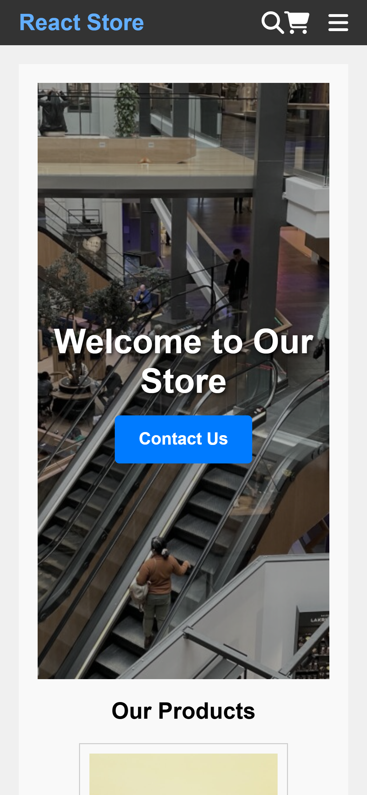

# semester-project-2-bootstrap

## Overview
This project is a React-based e-commerce store designed to provide a seamless shopping experience. The application features a variety of functionalities including product browsing, cart management, and a checkout process. It is built using modern web technologies and follows best practices for a responsive and user-friendly interface.

### Key Features
- **Product Browsing:** Users can browse through a list of products fetched from an API.
- **Product Details:** Detailed view of each product including images, descriptions, and reviews.
- **Cart Management:** Users can add products to their cart, update quantities, and remove items.
- **Checkout Process:** A streamlined checkout process with a success page upon completion.
- **Contact Form:** A contact page with a form for users to reach out to the store.
- **Search Functionality:** Users can search for products using a search bar in the navigation.

### Code Stack
- **React:** For building the user interface.
- **React Router:** For client-side routing.
- **Context API:** For state management of the shopping cart.
- **FontAwesome:** For icons.
- **CSS:** For styling components and pages.

## Project Structure
- **Components:** Reusable components such as Navbar, Footer, Product, and Cart.
- **Pages:** Different pages of the application including HomePage, ProductPage, CheckoutPage, CheckoutSuccessPage, and ContactPage.
- **Styles:** CSS files for styling the components and pages.
- **Assets:** Images and other static assets used in the project.

### Getting Started
1. **Clone** the repository to your local machine.
2. **Install Dependencies:** Run `npm install` to install all necessary dependencies.
3. **Start the Application:** Run `npm start` to start the development server and open the application in your browser.
4. **Explore:** Navigate through the application to explore its features.

### Contact
For any inquiries or feedback, please contact mariuskvaal1@gmail.com.

### Contribution
Feel free to fork the project and submit pull requests for improvements or new features.